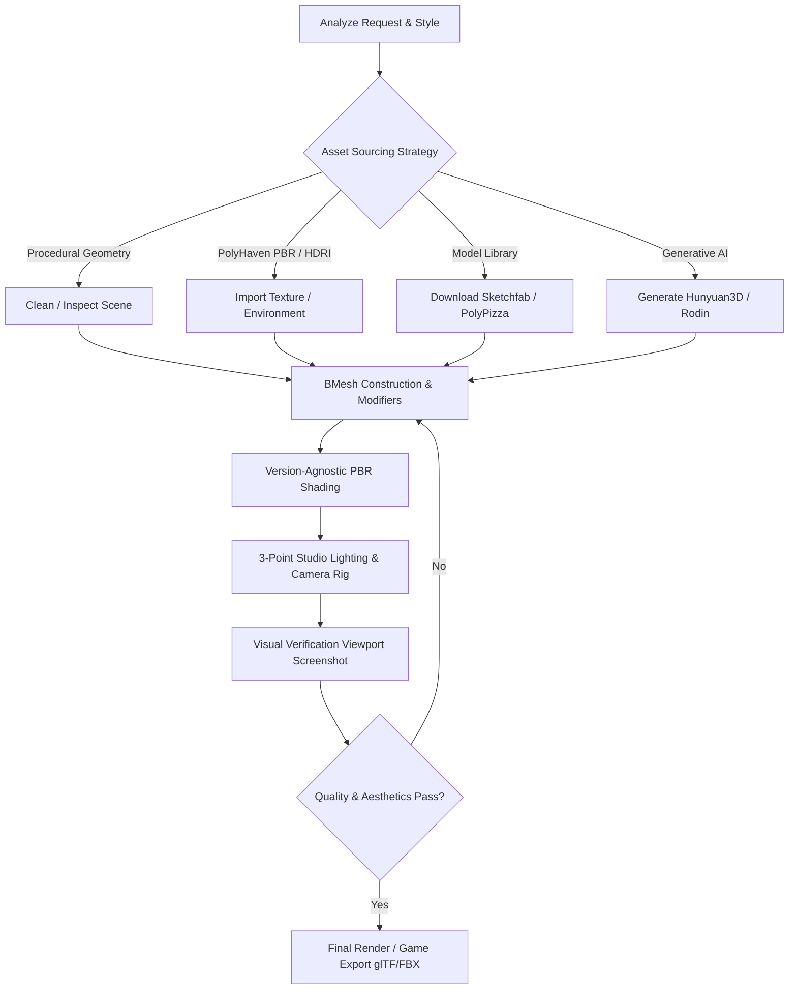

# Blender 3D Automation & Modeling Skill

A complete engineering guide for AI agents interacting with Blender via the Blender MCP server (`execute_blender_code`, `get_scene_info`, `get_object_info`, `get_viewport_screenshot`, and 3D asset integrations).

---

## 1. Core Workflow & Operational Protocol



### Golden Rules for MCP Execution:
1. **Idempotence & Scene Management**: Always check existing objects before creating new ones. When starting a fresh scene, purge or organize existing meshes into designated collections.
2. **Chunk Execution**: Break complex scenes into logical modular chunks (1. Base Meshes → 2. Details/Modifiers → 3. Materials → 4. Lighting & Camera → 5. Screenshot verification).
3. **Context-Safe Scripting**: In automated scripts, avoid relying on interactive UI state (e.g. `bpy.ops` that require active 3D view context). Prefer low-level `bmesh` operations or explicit `bpy.data` manipulation.
4. **Verbatim User Prompt**: When invoking `execute_blender_code`, pass the user's exact instruction in `user_prompt` for intent tracking across multi-step tasks.
5. **Version Agnosticism**: Use version-safe socket setters for `Principled BSDF` and `GeometryNodeTree` to ensure compatibility across Blender 3.x, 4.x, and 5.x.

---

## 2. Asset Sourcing Decision Matrix

| Source | Best Use Case | Primary MCP Tools / Methods |
| :--- | :--- | :--- |
| **Procedural `bmesh`** | Parametric objects, hard-surface, modular kits, low-poly assets, terrain | `execute_blender_code` (`bmesh`, `bpy.data`) |
| **Geometry Nodes** | Foliage/rock scattering, hanging cables, procedural grids, parametric arrays | `execute_blender_code` (`GeometryNodeTree`) |
| **Poly Haven** | Photorealistic PBR texture sets (diffuse, normal, roughness) & studio HDRIs | `search_polyhaven_assets`, `download_polyhaven_asset`, `set_texture` |
| **PolyPizza / Sketchfab** | Ready-to-use low-poly props, furniture, everyday objects | `search_polypizza_models`, `download_polypizza_model`, `search_sketchfab_models` |
| **Hunyuan3D / Rodin** | Complex organic shapes, characters, figurines generated from text/images | `generate_hunyuan3d_model`, `poll_hunyuan_job_status`, `import_generated_asset` |

---

## 3. Low-Level BMesh & Procedural Geometry

Prefer `bmesh` for clean vertex/face manipulation without UI context dependency:

```python
import bpy
import bmesh
import math
from mathutils import Vector, Euler

def create_mesh_object(name, collection_name="Scene_Objects"):
    col = bpy.data.collections.get(collection_name)
    if not col:
        col = bpy.data.collections.new(collection_name)
        bpy.context.scene.collection.children.link(col)
    
    mesh = bpy.data.meshes.new(name + "_Mesh")
    obj = bpy.data.objects.new(name, mesh)
    col.objects.link(obj)
    
    bm = bmesh.new()
    bmesh.ops.create_cube(bm, size=2.0)
    bm.to_mesh(mesh)
    bm.free()
    mesh.update()
    return obj
```

### Essential Modifiers:
- **Bevel**: Smooth sharp edges (`obj.modifiers.new("Bevel", "BEVEL")`, set `width`, `segments=3`, `limit_method='ANGLE'`).
- **Subdivision Surface**: Smooth surfaces (`obj.modifiers.new("Subsurf", "SUBSURF")`, set `levels=2`, `render_levels=3`).
- **Solidify**: Add wall thickness to hollow sheets (`obj.modifiers.new("Solidify", "SOLIDIFY")`, set `thickness=0.05`).
- **Mirror**: Symmetrical modeling (`obj.modifiers.new("Mirror", "MIRROR")`, set `use_axis=(True, False, False)`).

---

## 4. Version-Agnostic PBR Shading Pipeline

Blender 4.0+ renamed several `Principled BSDF` input sockets. Use this safe setter helper:

```python
import bpy

def safe_set_bsdf_input(bsdf_node, socket_alias, value):
    """
    Safely sets Principled BSDF input sockets across Blender 3.x, 4.x, and 5.x.
    """
    alias_map = {
        'specular': ['Specular IOR Level', 'Specular'],
        'metallic': ['Metallic'],
        'roughness': ['Roughness'],
        'base_color': ['Base Color'],
        'transmission': ['Transmission Weight', 'Transmission'],
        'emission_color': ['Emission Color', 'Emission'],
        'emission_strength': ['Emission Strength'],
        'subsurface_weight': ['Subsurface Weight', 'Subsurface'],
        'ior': ['IOR']
    }
    
    target_names = alias_map.get(socket_alias.lower(), [socket_alias])
    for name in target_names:
        if name in bsdf_node.inputs:
            bsdf_node.inputs[name].default_value = value
            return True
    return False

def create_pbr_material(name, base_color=(0.8, 0.8, 0.8, 1.0), metallic=0.0, roughness=0.4, emission_color=(0,0,0,1), emission_strength=0.0):
    mat = bpy.data.materials.get(name) or bpy.data.materials.new(name=name)
    mat.use_nodes = True
    nodes = mat.node_tree.nodes
    links = mat.node_tree.links
    nodes.clear()
    
    node_out = nodes.new(type="ShaderNodeOutputMaterial")
    node_bsdf = nodes.new(type="ShaderNodeBsdfPrincipled")
    node_out.location = (300, 0)
    node_bsdf.location = (0, 0)
    
    safe_set_bsdf_input(node_bsdf, 'base_color', base_color)
    safe_set_bsdf_input(node_bsdf, 'metallic', metallic)
    safe_set_bsdf_input(node_bsdf, 'roughness', roughness)
    
    if emission_strength > 0:
        safe_set_bsdf_input(node_bsdf, 'emission_color', emission_color)
        safe_set_bsdf_input(node_bsdf, 'emission_strength', emission_strength)
        
    links.new(node_bsdf.outputs['BSDF'], node_out.inputs['Surface'])
    return mat

def assign_material(obj, mat):
    if obj.data.materials:
        obj.data.materials[0] = mat
    else:
        obj.data.materials.append(mat)
```

---

## 5. Studio Lighting & Camera Composition

### 3-Point Studio Lighting Setup:
```python
import bpy
import math

def setup_studio_lighting(target_loc=(0, 0, 1.0)):
    # 1. Key Light (Bright, 45 degrees front-right)
    key_data = bpy.data.lights.new(name="Key_Light_Data", type='AREA')
    key_data.energy = 500
    key_data.size = 2.0
    key_data.color = (1.0, 0.98, 0.95)
    key_obj = bpy.data.objects.new("Key_Light", key_data)
    key_obj.location = (4, -4, 5)
    bpy.context.scene.collection.objects.link(key_obj)
    
    # 2. Fill Light (Soft, 45 degrees front-left)
    fill_data = bpy.data.lights.new(name="Fill_Light_Data", type='AREA')
    fill_data.energy = 180
    fill_data.size = 3.0
    fill_data.color = (0.92, 0.95, 1.0)
    fill_obj = bpy.data.objects.new("Fill_Light", fill_data)
    fill_obj.location = (-4, -3, 3)
    bpy.context.scene.collection.objects.link(fill_obj)
    
    # 3. Rim / Back Light (Accent, behind target)
    rim_data = bpy.data.lights.new(name="Rim_Light_Data", type='SPOT')
    rim_data.energy = 400
    rim_data.spot_size = math.radians(45)
    rim_obj = bpy.data.objects.new("Rim_Light", rim_data)
    rim_obj.location = (0, 4, 4)
    bpy.context.scene.collection.objects.link(rim_obj)
```

### Camera Auto-Framing & Turntable Showcase:
```python
import bpy
from mathutils import Vector

def setup_turntable_camera(target_obj, distance=6.0, elevation_deg=25.0, frame_count=120):
    """
    Creates a 360-degree orbit turntable animation around the target object.
    """
    target_center = target_obj.location
    
    # Create Camera and Empty Rig
    empty = bpy.data.objects.new("Turntable_Center", None)
    empty.location = target_center
    bpy.context.scene.collection.objects.link(empty)
    
    cam_data = bpy.data.cameras.new("Turntable_Cam")
    cam_data.lens = 50
    cam_obj = bpy.data.objects.new("Turntable_Cam_Obj", cam_data)
    bpy.context.scene.collection.objects.link(cam_obj)
    
    cam_obj.location = target_center + Vector((0, -distance, distance * math.tan(math.radians(elevation_deg))))
    cam_obj.parent = empty
    
    # Track to constraint
    track = cam_obj.constraints.new(type='TRACK_TO')
    track.target = empty
    track.track_axis = 'TRACK_NEGATIVE_Z'
    track.up_axis = 'UP_Y'
    
    # Animate 360 rotation on empty
    bpy.context.scene.frame_start = 1
    bpy.context.scene.frame_end = frame_count
    
    empty.rotation_euler = (0, 0, 0)
    empty.keyframe_insert(data_path="rotation_euler", index=2, frame=1)
    
    empty.rotation_euler = (0, 0, math.radians(360))
    empty.keyframe_insert(data_path="rotation_euler", index=2, frame=frame_count + 1)
    
    # Linear interpolation for seamless looping
    if empty.animation_data and empty.animation_data.action:
        for fcurve in empty.animation_data.action.fcurves:
            for kf in fcurve.keyframe_points:
                kf.interpolation = 'LINEAR'
                
    bpy.context.scene.camera = cam_obj
    return cam_obj, empty
```

---

## 6. Render Engine Presets

```python
import bpy

def configure_render_engine(engine='EEVEE_NEXT', samples=64, resolution=(1920, 1080)):
    scene = bpy.context.scene
    scene.render.resolution_x = resolution[0]
    scene.render.resolution_y = resolution[1]
    scene.render.resolution_percentage = 100
    
    if engine.upper() in ['CYCLES', 'PATH_TRACING']:
        scene.render.engine = 'CYCLES'
        scene.cycles.samples = samples
        scene.cycles.use_denoising = True
        scene.cycles.adaptive_threshold = 0.01
    else:
        scene.render.engine = 'BLENDER_EEVEE_NEXT' if hasattr(bpy.types, 'RenderSettings') else 'BLENDER_EEVEE'
```

---

## 7. Visual Inspection & Iterative Quality Gates

1. **Verify Scene Hierarchy**: Call `get_scene_info` to ensure object count and collection structure match expected architecture.
2. **Inspect Transform & Vertex Counts**: Call `get_object_info(object_name="...")` to verify scale `(1,1,1)`, bounding box, and modifier state.
3. **Capture Viewport Screenshot**: Call `get_viewport_screenshot` to inspect framing, light reflections, and shadow falloff.
4. **Refine & Polish**: Adjust material roughness, color ramps, or light power as needed.

---

## 8. Reference Modules & Detailed Guides

- [**Blender MCP Tool Integration**](file:///home/andim/.gemini/config/skills/blender-automation/references/blender-mcp-integration.md): Tool reference for core execution, PolyHaven, Sketchfab, and Generative 3D AI.
- [**Procedural Modeling Recipes**](file:///home/andim/.gemini/config/skills/blender-automation/references/procedural-modeling-recipes.md): Terrain, low-poly foliage, studio backdrop, and modular sci-fi panels.
- [**Procedural Geometry Nodes Recipes**](file:///home/andim/.gemini/config/skills/blender-automation/references/geometry-nodes-recipes.md): Scattering instances on surfaces, procedural cables, and modular grid arrays.
- [**Shader Node Library**](file:///home/andim/.gemini/config/skills/blender-automation/references/shader-node-library.md): Brushed metals, neon emission, and procedural marble shaders.
- [**Game-Ready Export Pipeline**](file:///home/andim/.gemini/config/skills/blender-automation/references/game-engine-export-pipeline.md): Mesh hygiene checks, smart UV unwrapping, LOD generation, and glTF/FBX export scripts.
- [**Physics & Simulation Recipes**](file:///home/andim/.gemini/config/skills/blender-automation/references/physics-and-simulation.md): Rigid body dynamics, procedural cloth draping, and keyframe baking.
